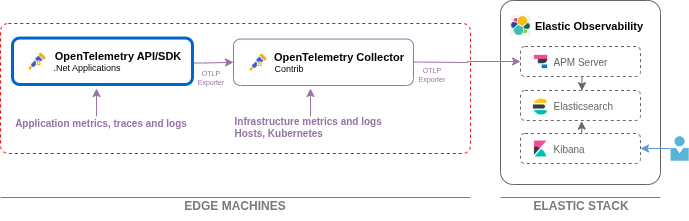

# Elastic Stack w/OpenTelemetry Collector
This repo contains a common docker compose setup for the Elastic Stack using Elastic Search, Elastic APM, Kibana and an Open Teleemetry Collector.  It provides a quick way to collect, process, and forward traces, metrics, and logs from your applications to an Elastic Stack instance for monitoring and analysis.





## 📁 Contents

- **docker-compse.yml**: Docker Compose file to orchestrate the OpenTelemetry Collector and any supporting services.
- **otel-collector-config.yml**: Configuration file for the OpenTelemetry Collector, specifying receivers, processors, and exporters (including Elastic).
- **README.md**: This documentation file.

## ⚙️ Prerequisites

- [Docker](https://docs.docker.com/get-docker/) and [Docker Compose](https://docs.docker.com/compose/) installed on your machine.


## 🚀 Setup & Usage

> The setup in this repo is geared for local development usage and should not be considered for production without adjustments.


### 1. Start the Elastic ELK stack services:

	```bash
	docker compose -f docker-compose.yml up -d

	# Or if the containers have already been created
	docker compose -f docker-compose.yml start

	```

	This will start the elastic stack and Open Telemetry Collector using the provided configuration and will group the containers under the project name `elastic-stack` in Docker Desktop and the CLI.

	To bring the compose down, use this command
	```bash
	docker compose -f docker-compose.yml down -v

	```

	To force a rebuild and deploy of an individual container use this command

	```
	docker compose up -d --force-recreate --no-deps --build <service_name>
	```

### 2. Send Telemetry Data:
	- Point your application(s) to the Open Telemetry Collector endpoint (as defined in `otel-collector-config.yml`).
      - http://localhost:4317 (when outside the compose network)
      - http://otel-collector:4317 (when inside the compose network)
	- The collector will receive, process, and forward telemetry data to your Elastic APM instance.

   **Monitor in Kibana:**
	- Log in to your Elastic Observability Kibana dashboard to view traces, metrics, and logs. http://localhost:5601

## 🛠️ Customization

- Modify `otel-collector-config.yml` to add or remove receivers, processors, or exporters as needed for your environment.
- Refer to the [OpenTelemetry Collector documentation](https://opentelemetry.io/docs/collector/configuration/) for advanced configuration options.

## 🐞 Troubleshooting

- Check container logs for errors:
  ```bash
	docker compose -f docker-compose.yml logs
  ```
- Ensure network connectivity between the collector and your Elastic instance.
- Validate your credentials and endpoint URLs in the configuration file.

## 🌐 Community & Support

- 🤝 Contributing Guide – see [CONTRIBUTING.md](.github/CONTRIBUTING.md)
- 🤗 Code of Conduct – see [CODE_OF_CONDUCT.md](.github/CODE_OF_CONDUCT.md)
- 🆘 Support Guide – see [SUPPORT.md](.github/SUPPORT.md)
- 🔒 Security Policy – see [SECURITY.md](.github/SECURITY.md)

## 📄 License

This project is licensed under the terms of the repository's main LICENSE file.

---
For more information, see the official documentation for [OpenTelemetry Collector](https://opentelemetry.io/docs/collector/) and [Elastic Observability](https://www.elastic.co/guide/en/observability/current/index.html).
